### Summary
- A **Domain Controller** machine. We first find **SMB anonymous read access** to a share containing a list of folders which can be used as usernames.
- We perform an **ASREPRoast attack** using the created wordlist to get credentials for the `support` user.
- *Using* **BloodHound** *to enumerate the domain,* we find that this user *can reset the password for another account* `audit2020`
- *After resetting* `audit2020`'*s password*, we gain access to the `forensic` **SMB share** which has a **memory dump** of `lsass.exe`
- *Using* `Mimikatz` *to extract hashes from the dump,* we gain access to the `svc_backup` user.
- `svc_backup` is a member of the **Backup Operators** group which have the *privilege of backing up most files on the domain controller*.
- We *abuse* this privilege to back up the **NTDS.dit** file and the **system registry hive** which we use to dump **all the NTLM hashes of the domain**.
- *With the Domain Administrators NTLM hash,* we can **Pass-the-Hash** to gain full access.

---

### Standard Nmap
We do a standard `nmap` with service detection `-sV` and default scripts `-sC` on all ports:
```
PORT     STATE SERVICE       VERSION
53/tcp   open  domain        Simple DNS Plus
88/tcp   open  kerberos-sec  Microsoft Windows Kerberos (server time: 2022-04-15 21:28:00Z)
135/tcp  open  msrpc         Microsoft Windows RPC
389/tcp  open  ldap          Microsoft Windows Active Directory LDAP (Domain: BLACKFIELD.local0., Site: Default-First-Site-Name)
445/tcp  open  microsoft-ds?
593/tcp  open  ncacn_http    Microsoft Windows RPC over HTTP 1.0
3268/tcp open  ldap          Microsoft Windows Active Directory LDAP (Domain: BLACKFIELD.local0., Site: Default-First-Site-Name)
5985/tcp open  http          Microsoft HTTPAPI httpd 2.0 (SSDP/UPnP)
|_http-server-header: Microsoft-HTTPAPI/2.0
|_http-title: Not Found
Service Info: Host: DC01; OS: Windows; CPE: cpe:/o:microsoft:windows

Host script results:
|_clock-skew: 6h59m58s
| smb2-security-mode: 
|   3.1.1: 
|_    Message signing enabled and required
| smb2-time: 
|   date: 2022-04-15T21:28:14
|_  start_date: N/A
```

### Domain Controller Signature

We see a combination of ports indicative of a **Domain Controller**: **DNS** on 53, **Kerberos** on 88, **LDAP** on 389 and **SMB** on 445.
We also notice the domain name on LDAP is **Blackfield.local** and the hostname **DC01**

we add an `nameserver` entry in our `/etc/resolv.conf` file for the machine's IP and proceed to enumerate **SMB** for null/anonymous access.

### SMB Enumeration

we try a few inputs and manage to get a listing of the shares using anonymous authentication:

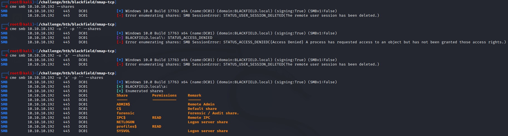

*looking at the shares,* we see that we have `READ` access to the `profiles$` share. We also notice another non-standard share: `forensic` that had a comment `Forensic / Audit share`

*connecting with* `smbclient`, we see many folders that look like usernames:

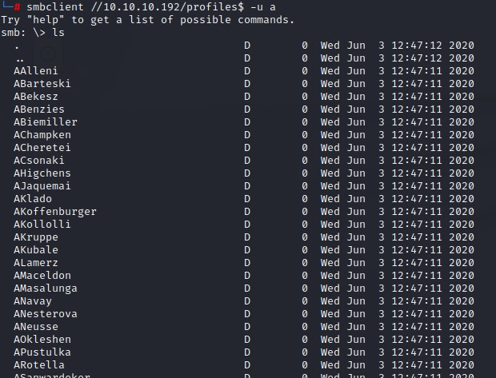

### Mounting SMB to Linux

we mount the share using `mount -t cifs -o 'username=a' //10.10.10.192/Profiles$ /mnt` so we can use handy commands like `find` and look for interesting files within.

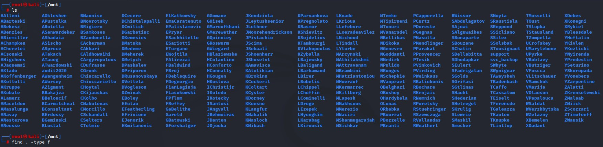

we notice no files are there. But, we can still save those foldernames to be used as a *userlist* for future attacks. we do that using `ls` with the `-1` flag to have the names on one column.

### ASREPRoasting

*Having this list,* we launch an `ASREPRoast` attack using `impacket`'s `GetNPUsers.py`. 

`GetNPUsers.py -dc-ip 10.10.10.192 blackfield.local/ -request -usersfile users.txt`

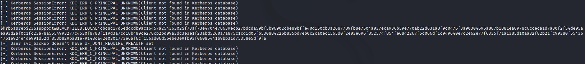

*looking at the output,* we notice the hash has been captured for the `support` user. We also notice that *for most users,* we get the error: `Kerberos SessionError: KDC_ERR_C_PRINCIPAL_UNKNOWN(Client not found in Kerberos database)` that indicates that those usernames don't exist. *As for the users with the error:* `User <USER> doesn't have UF_DONT_REQUIRE_PREAUTH set` they exist but are not *ASREPRoastable*.

these were `svc_backup` and `audit2020`.

we're going to need to get to that `audit2020` user if we want access to its share (`forensic`).

*Right now,* we need to crack the hash for the `support` user. We do that using `john` and the password is `#00^BlackKnight`.

We try authenticating using `crackmapexec` and are successful.

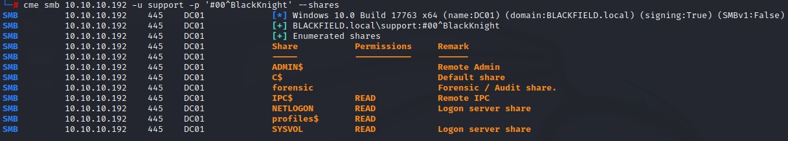

We try to remote using **WinRM** but no luck :/

### Getting all AD users for future attacks

*After investigating the new-accessible shares* `SYSVOL` *and* `NETLOGON`, we find nothing important. So we proceed to pull the full userlist from the domain using `impacket`'s `GetADUsers.py`:


we find that the usernames we found in the `profiles$` have different `SamAccountNames` and that's why they weren't authenticating.

### Kerberoasting & ASREPRoasting

we use the new AD user list to launch another `ASREPRoast` attack but get no new results.

we also try `Kerberoasting` but find no entries:


### Pattern guessing & Password Spraying

I use `crackmapexec` to get the password policy of the domain before doing any spraying


Looks like there's no account lockout at all :D

I spray with the full AD userlist from `GetADUsers.py` with the `support` password and some variants like: `#01^BlackKnight` but get nothing either :/

### Bloodhound & Abusing the `ForceChangePassword` right

I then use `bloodhound` to get a look at what I can do with the support account. And I notice that I can reset the password for the `audit2020` user:


I find this right by clicking the `First Degree Object Control` box under the `Node Info` tab as highlighted in the image above.

*By right-clicking the link,* I find the `PowerView` command that I can run to abuse this right. This is awesome!


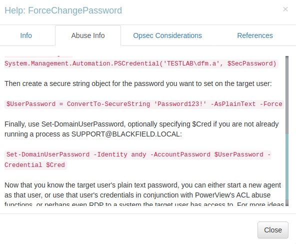

*it says that by using the command* `Set-DomainUserPassword`, we can reset the password for the `audit2020` account and be able to use it.

### Using a Windows machine to do the deed

We can do so by using a `Windows` host. We can run the `RunAs.exe` utility with the `/netonly` flag. That would let us use a set of credentials in the network's context and be able to do stuff.

But we first have to set the DNS on both the `Ethernet` and `OpenVPN` interfaces:

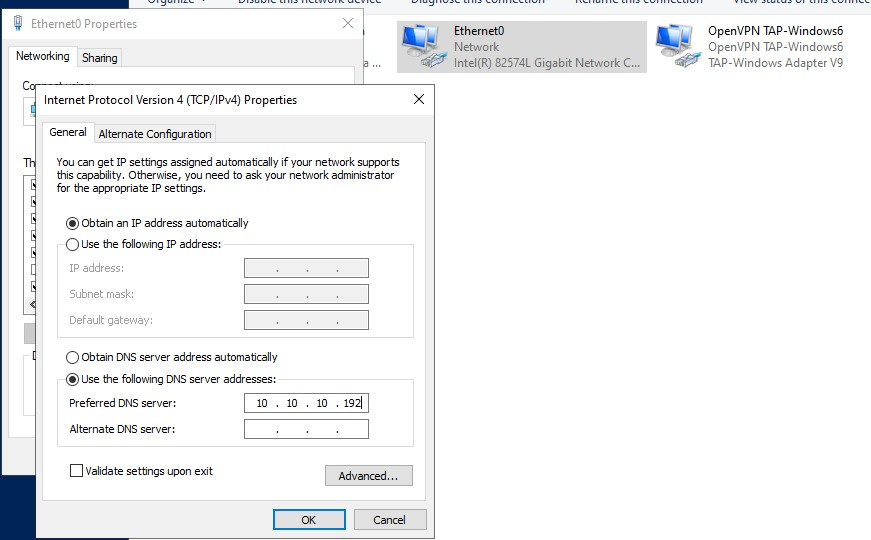

we can then authenticate to the network as the `support` user and we are able to list the **SMB** shares:


we import `PowerView.ps1` and use the `Set-DomainUserPassword` with the `-Domain` flag and use the `-Verbose` flag (*in case we need to troubleshoot*). Making sure to have the password *complex enough* and casting it to a `Secure String` object using the `ConvertTo-SecureString` **PowerShell** cmdlet.

The command does take some time... But we're successful in resetting the password to `Password123!` in the end :D

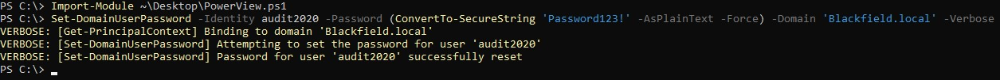

### SMB forensic share enumeration

*Using the new password,* we find that we can now read the `forensic` share.

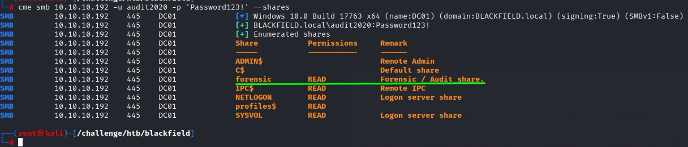

*after mounting it,* we see that there's a very interesting file that we can access in the `memory_analysis` folder. That is `lsass.zip`.

### A brief about LSASS

**LSASS.exe** is the main authentication process in **Windows**. This process holds the credentials of all users who had logged into the computer using one way or another.

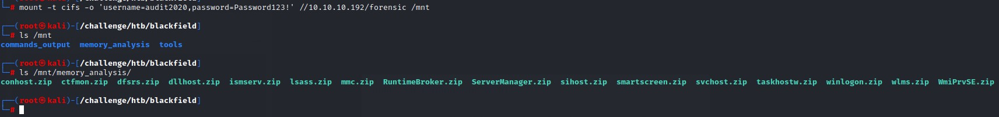

we unzip the `lsass.zip` file to find a `.DMP` file which is a memory dump of the process.

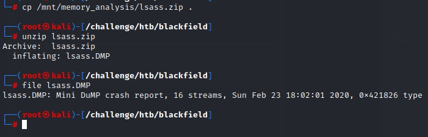

### Extracting credentials from LSASS dump

we can use a tool called `pypykatz` (https://github.com/skelsec/pypykatz) to obtain hashes from the `.DMP` files.

`pypykatz lsa minidump lsass.DMP` is the command.

We do a `grep` for the **NT** field for the **NTLM hash** and use the `-B` flag to get th 3 lines before it to get the usernames.


we find hashes for both the `Administrator` user and `svc_backup` accounts

*Sadly,* the hash for the `administrator` account didn't work, but the one for `svc_backup` did. And it also had access to **PowerShell Remoting** :)


### Abusing the `SeBackupPrivilege` held by the `Backup Operators` AD Group

*checking the group memberships on the* `svc_backup` *user,* we notice it's a member of the `Backup Operators` group. *And, by extension,* it has the `SeBackupPrivilege`.


Having this privilege is very dangerous. This is because the ability to backup files includes a full `READ` access to most files on the system. The most critical being `NTDS.dit` which is the database where the usernames and hashes are stored within a **Domain Controller**.

Being able to grab the `NTDS.dit` and the `SYSTEM` registry hive would enable us to read all the hashes of the domain *including the* **domain administrator's** *one.*

*By doing some research,* we come across this awesome post from **Hacking Articles** (https://www.hackingarticles.in/windows-privilege-escalation-sebackupprivilege/) that tells us how we can abuse this privilege.

### Diskshadow

We will be using the `diskshadow` command line utility with the `/s` flag for script mode and passing a script file as an argument.

The content should be something like:

```
set context persistent nowriters
add volume c: alias abuse
create
expose %abuse% z:
```

this would essentially expose a *shadow* copy of the `c:` drive to another drive `z:`.

This is required because a file like `NTDS.dit` is constantly undergoing `READ` and `WRITE` operations which would make copying it infeasable under normal circumstances.

### Changing encoding to match Windows

*Having created this script file in* **Linux**, we will need to change its encoding to fit **Windows** for it to work properly. This can be done using the `unix2dos` command:

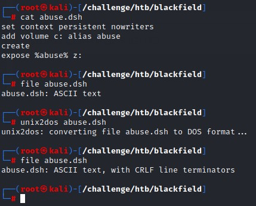

notice how the output of `file` command changes from `ASCII text` to `ASCII text, with CRLF line terminators` after conversion.

we upload the `.dsh` file using `evil-winrm`'s `upload` function. And, we change to a writable directory `c:\windows\temp` where we can run the utility:


it succeeds and we can list the contents of `c:` from `z:`

### Special copying mode: `Backup Mode`

*to be able to get a copy of* `NTDS.dit` *from* `z:\`, we would need to use the `Robocopy` command-line utility with `/b` flag for `backup mode`. This would basically allow the copying to bypass the `ACLs` of the file if the `SeBackupPrivilege` was held.

```
robocopy /?

-------------------------------------------------------------------------------
   ROBOCOPY     ::     Robust File Copy for Windows
-------------------------------------------------------------------------------

  Started : 18 April 2022 20:10:47
              Usage :: ROBOCOPY source destination [file [file]...] [options]
             source :: Source Directory (drive:\path or \\server\share\path).
        destination :: Destination Dir  (drive:\path or \\server\share\path).
               file :: File(s) to copy  (names/wildcards: default is "*.*").

::
:: Copy options :
::

                 /S :: copy Subdirectories, but not empty ones.
                 /E :: copy subdirectories, including Empty ones.
             /LEV:n :: only copy the top n LEVels of the source directory tree.
                 /Z :: copy files in restartable mode.
                 /B :: copy files in Backup mode.  <-------------
                /ZB :: use restartable mode; if access denied use Backup mode.
                 /J :: copy using unbuffered I/O (recommended for large files).
            /EFSRAW :: copy all encrypted files in EFS RAW mode.
```

*using the command:* `robocopy /b z:\windows\ntds . ntds.dit`, the copy is a success! :D

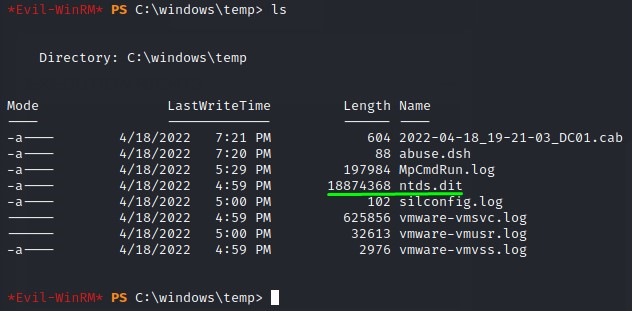

we can then use the `reg` command with the `save` option to get the `SYSTEM` hive:

`reg save hklm\system c:\windows\Temp\system`

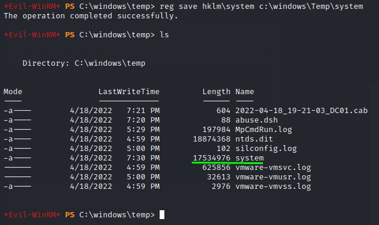

### Hashes everywhere

we can use `evil-winrm` `download` functionality to retrieve the files to our kali machine. where can use `impacket`'s `secretsdump.py` script to dump all the contents.

*And down all the hashes go...*


*having the domain administrator's hash,* we can easily remote in using **PowerShell Remoting** and we're admin on the box :D

